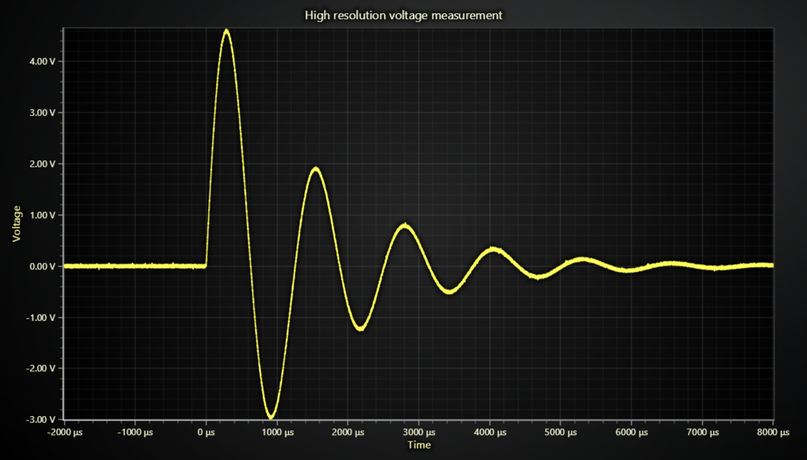

# JavaScript Microseconds Line Chart



This demo application belongs to the set of examples for LightningChart JS, data visualization library for JavaScript.

LightningChart JS is entirely GPU accelerated and performance optimized charting library for presenting massive amounts of data. It offers an easy way of creating sophisticated and interactive charts and adding them to your website or web application.

The demo can be used as an example or a seed project. Local execution requires the following steps:

-   Make sure that relevant version of [Node.js](https://nodejs.org/en/download/) is installed
-   Open the project folder in a terminal:

          npm install              # fetches dependencies
          npm start                # builds an application and starts the development server

-   The application is available at _http://localhost:8080_ in your browser, webpack-dev-server provides hot reload functionality.


## Description

This example shows how to display high-resolution data - for example, measurements in microseconds precision.

When displaying high-resolution data there is a need to do some scaling to the data before adding it to a series.
LightningChart JS Axis is limited by floating point precision so when using really small or really large values there is a need to scale the values to be closer to 0.

```js
const dataScaleX = 1 * Math.pow(1000, 3) // 1 us
const renderData = (data) => {
    // Add data.
    lineSeries.add(data.map((p) => ({ x: p.x * dataScaleX, y: p.y })))
}
```

When the data is scaled closer to 0 then the LightningChart JS Axis is able to function properly but the values shown in the auto-cursor would be incorrect as it would show the scaled value, not the original. This can be fixed by setting a formatting function to the axis tick strategy.

```js
lineSeries.axisX.setTickStrategy(AxisTickStrategies.Numeric, (strategy) =>
    strategy
        // Format ticks with units.
        .setFormattingFunction((timeScaled) => Math.round(timeScaled) + ' μs'),
)
```

Alternatively if the original value would be preferred then the scaling could be undone.

```js
lineSeries.axisX.setTickStrategy(AxisTickStrategies.Numeric, (strategy) =>
    strategy.setFormattingFunction((timeScaled) => timeScaled / dataScaleX),
)
```


## API Links

* [XY cartesian chart]
* [Line series]
* [Numeric Axis tick strategy]
* [Data patterns]


## Support

If you notice an error in the example code, please open an issue on [GitHub][0] repository of the entire example.

Official [API documentation][1] can be found on [LightningChart][2] website.

If the docs and other materials do not solve your problem as well as implementation help is needed, ask on [StackOverflow][3] (tagged lightningchart).

If you think you found a bug in the LightningChart JavaScript library, please contact sales@lightningchart.com.

Direct developer email support can be purchased through a [Support Plan][4] or by contacting sales@lightningchart.com.

[0]: https://github.com/Arction/
[1]: https://lightningchart.com/lightningchart-js-api-documentation/
[2]: https://lightningchart.com
[3]: https://stackoverflow.com/questions/tagged/lightningchart
[4]: https://lightningchart.com/support-services/

© LightningChart Ltd 2009-2022. All rights reserved.


[XY cartesian chart]: https://lightningchart.com/js-charts/api-documentation/v5.1.0/classes/ChartXY.html
[Line series]: https://lightningchart.com/js-charts/api-documentation/v5.1.0/classes/LineSeries.html
[Numeric Axis tick strategy]: https://lightningchart.com/js-charts/api-documentation/v5.1.0/variables/AxisTickStrategies.html
[Data patterns]: https://lightningchart.com/js-charts/api-documentation/v5.1.0/interfaces/DataPattern.html

